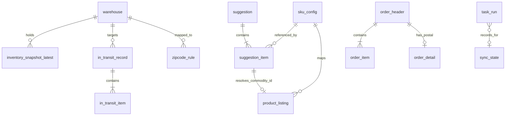

# Phase 1 Data Model: 赛狐补货计算工具

**Date**: 2026-04-08
**Database**: PostgreSQL 16
**Migration Tool**: Alembic

共 **20 张表**，覆盖：用户/鉴权、赛狐元数据、产品、库存、在途、订单、规则引擎、任务系统、观测。

---

## 约定

- 所有表主键列为 `id bigserial`（除非另有说明）
- 所有表含 `created_at timestamptz NOT NULL DEFAULT now()` 和 `updated_at timestamptz NOT NULL DEFAULT now()`
- JSONB 字段用于存半结构化数据（明细/快照/参数）
- 时间字段统一为 `timestamptz`，写入时统一转换为 `Asia/Shanghai` 后存储
- 所有字符串默认 `varchar`，无需精确长度时用 `text`

---

## 1. 用户 / 鉴权 / 配置

### 1.1 `global_config`（全局参数，单行 KV）

```sql
CREATE TABLE global_config (
    id              smallint PRIMARY KEY DEFAULT 1 CHECK (id = 1),
    buffer_days     integer NOT NULL DEFAULT 30,
    target_days     integer NOT NULL DEFAULT 60,
    lead_time_days  integer NOT NULL DEFAULT 50,
    sync_interval_minutes integer NOT NULL DEFAULT 60,
    calc_cron       varchar NOT NULL DEFAULT '0 8 * * *',
    default_purchase_warehouse_id varchar,
    include_tax     varchar NOT NULL DEFAULT '0' CHECK (include_tax IN ('0','1')),
    shop_sync_mode  varchar NOT NULL DEFAULT 'all' CHECK (shop_sync_mode IN ('all','specific')),
    login_password_hash varchar NOT NULL,
    login_failed_count  integer NOT NULL DEFAULT 0,
    login_locked_until  timestamptz,
    jwt_secret      varchar NOT NULL,
    created_at      timestamptz NOT NULL DEFAULT now(),
    updated_at      timestamptz NOT NULL DEFAULT now()
);
```

### 1.2 `access_token_cache`（赛狐 token 缓存，单行）

```sql
CREATE TABLE access_token_cache (
    id           smallint PRIMARY KEY DEFAULT 1 CHECK (id = 1),
    access_token text NOT NULL,
    acquired_at  timestamptz NOT NULL,
    expires_at   timestamptz NOT NULL,
    updated_at   timestamptz NOT NULL DEFAULT now()
);
```

---

## 2. 赛狐元数据

### 2.1 `warehouse`（仓库）

```sql
CREATE TABLE warehouse (
    id                varchar PRIMARY KEY,            -- 赛狐 warehouse.id
    name              varchar NOT NULL,
    type              integer NOT NULL,               -- -1虚拟/0默认/1国内/2FBA/3海外
    country           varchar,                        -- 二字码，手动维护，可空=待指定
    replenish_site_raw varchar,                       -- 赛狐原始值仅供参考
    last_sync_at      timestamptz NOT NULL,
    created_at        timestamptz NOT NULL DEFAULT now(),
    updated_at        timestamptz NOT NULL DEFAULT now()
);
CREATE INDEX warehouse_country_idx ON warehouse(country) WHERE country IS NOT NULL;
CREATE INDEX warehouse_type_idx ON warehouse(type);
```

### 2.2 `shop`（店铺）

```sql
CREATE TABLE shop (
    id             varchar PRIMARY KEY,              -- 赛狐 shop.id
    name           varchar NOT NULL,
    seller_id      varchar,
    region         varchar,                          -- na/eu/fe
    marketplace_id varchar,
    status         varchar NOT NULL,                 -- 0正常/1授权失效/2SP授权失效
    ad_status      varchar,
    sync_enabled   boolean NOT NULL DEFAULT true,    -- 指定店铺模式下用户勾选
    last_sync_at   timestamptz,
    created_at     timestamptz NOT NULL DEFAULT now(),
    updated_at     timestamptz NOT NULL DEFAULT now()
);
CREATE INDEX shop_status_idx ON shop(status);
```

### 2.3 `sku_config`（SKU 业务配置）

```sql
CREATE TABLE sku_config (
    commodity_sku   varchar PRIMARY KEY,
    enabled         boolean NOT NULL DEFAULT true,
    lead_time_days  integer,                         -- NULL 表示用全局
    created_at      timestamptz NOT NULL DEFAULT now(),
    updated_at      timestamptz NOT NULL DEFAULT now()
);
CREATE INDEX sku_config_enabled_idx ON sku_config(enabled) WHERE enabled = true;
```

### 2.4 `product_listing`（SKU ↔ 店铺 ↔ 站点 listing）

```sql
CREATE TABLE product_listing (
    id               bigserial PRIMARY KEY,
    commodity_sku    varchar NOT NULL,
    commodity_id     varchar NOT NULL,               -- 采购单创建必需
    shop_id          varchar NOT NULL,
    marketplace_id   varchar NOT NULL,               -- 已转二字码
    seller_sku       varchar,
    parent_sku       varchar,
    commodity_name   text,
    main_image       text,
    day7_sale_num    integer,                        -- 仅存储供对账参考
    day14_sale_num   integer,
    day30_sale_num   integer,
    is_matched       boolean NOT NULL DEFAULT true,
    online_status    varchar NOT NULL DEFAULT 'active',
    last_sync_at     timestamptz NOT NULL,
    created_at       timestamptz NOT NULL DEFAULT now(),
    updated_at       timestamptz NOT NULL DEFAULT now()
);
CREATE UNIQUE INDEX product_listing_unique ON product_listing(shop_id, marketplace_id, seller_sku);
CREATE INDEX product_listing_sku_mkt_idx ON product_listing(commodity_sku, marketplace_id);
CREATE INDEX product_listing_commodity_sku_idx ON product_listing(commodity_sku);
```

---

## 3. 库存

### 3.1 `inventory_snapshot_latest`（最新快照）

```sql
CREATE TABLE inventory_snapshot_latest (
    commodity_sku varchar NOT NULL,
    warehouse_id  varchar NOT NULL REFERENCES warehouse(id),
    country       varchar,                           -- 派生自 warehouse.country
    available     integer NOT NULL DEFAULT 0,
    reserved      integer NOT NULL DEFAULT 0,
    updated_at    timestamptz NOT NULL DEFAULT now(),
    PRIMARY KEY (commodity_sku, warehouse_id)
);
CREATE INDEX inventory_latest_country_idx ON inventory_snapshot_latest(country, commodity_sku);
```

### 3.2 `inventory_snapshot_history`（每日归档）

```sql
CREATE TABLE inventory_snapshot_history (
    id            bigserial PRIMARY KEY,
    commodity_sku varchar NOT NULL,
    warehouse_id  varchar NOT NULL,
    country       varchar,
    available     integer NOT NULL,
    reserved      integer NOT NULL,
    snapshot_date date NOT NULL
);
CREATE INDEX inventory_history_date_sku_idx ON inventory_snapshot_history(snapshot_date, commodity_sku);
CREATE INDEX inventory_history_sku_date_idx ON inventory_snapshot_history(commodity_sku, snapshot_date);
```

---

## 4. 在途

### 4.1 `in_transit_record`（出库单级）

```sql
CREATE TABLE in_transit_record (
    saihu_out_record_id varchar PRIMARY KEY,
    out_warehouse_no    varchar,
    target_warehouse_id varchar REFERENCES warehouse(id),
    target_country      varchar,                     -- 派生自 warehouse.country
    remark              text,
    status              varchar,                     -- 0待确认 1已确认
    is_in_transit       boolean NOT NULL DEFAULT true,
    last_seen_at        timestamptz NOT NULL,
    created_at          timestamptz NOT NULL DEFAULT now(),
    updated_at          timestamptz NOT NULL DEFAULT now()
);
CREATE INDEX in_transit_record_active_idx
    ON in_transit_record(is_in_transit, target_country)
    WHERE is_in_transit = true;
CREATE INDEX in_transit_record_last_seen_idx ON in_transit_record(last_seen_at);
```

### 4.2 `in_transit_item`（出库单明细）

```sql
CREATE TABLE in_transit_item (
    id                  bigserial PRIMARY KEY,
    saihu_out_record_id varchar NOT NULL REFERENCES in_transit_record(saihu_out_record_id) ON DELETE CASCADE,
    commodity_sku       varchar NOT NULL,
    goods               integer NOT NULL             -- 赛狐 goods 字段=可用数=在途数
);
CREATE INDEX in_transit_item_record_idx ON in_transit_item(saihu_out_record_id);
CREATE INDEX in_transit_item_sku_idx ON in_transit_item(commodity_sku);
```

---

## 5. 订单

### 5.1 `order_header`（订单骨架）

```sql
CREATE TABLE order_header (
    id               bigserial PRIMARY KEY,
    shop_id          varchar NOT NULL,
    amazon_order_id  varchar NOT NULL,
    marketplace_id   varchar NOT NULL,               -- 二字码
    country_code     varchar NOT NULL,
    order_status     varchar NOT NULL,
    order_total_currency varchar,
    order_total_amount numeric,
    fulfillment_channel varchar,
    purchase_date    timestamptz NOT NULL,           -- 已转北京时间
    last_update_date timestamptz NOT NULL,           -- 已转北京时间
    is_buyer_requested_cancel boolean NOT NULL DEFAULT false,
    refund_status    varchar,                        -- 0未退/1发起/2已退
    last_sync_at     timestamptz NOT NULL,
    created_at       timestamptz NOT NULL DEFAULT now(),
    updated_at       timestamptz NOT NULL DEFAULT now()
);
CREATE UNIQUE INDEX order_header_unique ON order_header(shop_id, amazon_order_id);
CREATE INDEX order_header_purchase_date_idx ON order_header(purchase_date);
CREATE INDEX order_header_country_purchase_idx ON order_header(country_code, purchase_date);
CREATE INDEX order_header_last_update_idx ON order_header(last_update_date);
```

### 5.2 `order_item`（订单明细）

```sql
CREATE TABLE order_item (
    order_id         bigint NOT NULL REFERENCES order_header(id) ON DELETE CASCADE,
    order_item_id    varchar NOT NULL,               -- 赛狐 orderItemId
    commodity_sku    varchar NOT NULL,
    seller_sku       varchar,
    quantity_ordered integer NOT NULL DEFAULT 0,
    quantity_shipped integer NOT NULL DEFAULT 0,
    quantity_unfulfillable integer NOT NULL DEFAULT 0,
    refund_num       integer NOT NULL DEFAULT 0,
    item_price_currency varchar,
    item_price_amount numeric,
    PRIMARY KEY (order_id, order_item_id)
);
CREATE INDEX order_item_commodity_sku_idx ON order_item(commodity_sku);
```

### 5.3 `order_detail`（订单详情 - 含邮编）

```sql
CREATE TABLE order_detail (
    shop_id          varchar NOT NULL,
    amazon_order_id  varchar NOT NULL,
    postal_code      varchar,
    country_code     varchar,
    state_or_region  varchar,
    city             varchar,
    detail_address   text,
    receiver_name    varchar,
    fetched_at       timestamptz NOT NULL,
    PRIMARY KEY (shop_id, amazon_order_id)
);
CREATE INDEX order_detail_postal_idx ON order_detail(country_code, postal_code) WHERE postal_code IS NOT NULL;
```

### 5.4 `order_detail_fetch_log`（详情拉取记录）

```sql
CREATE TABLE order_detail_fetch_log (
    shop_id         varchar NOT NULL,
    amazon_order_id varchar NOT NULL,
    fetched_at      timestamptz NOT NULL DEFAULT now(),
    http_status     integer,
    saihu_code      integer,
    saihu_msg       text,
    PRIMARY KEY (shop_id, amazon_order_id)
);
```

---

## 6. 规则引擎与建议单

### 6.1 `zipcode_rule`（邮编→仓库规则）

```sql
CREATE TABLE zipcode_rule (
    id              bigserial PRIMARY KEY,
    country         varchar NOT NULL,
    prefix_length   integer NOT NULL,
    value_type      varchar NOT NULL CHECK (value_type IN ('number','string')),
    operator        varchar NOT NULL CHECK (operator IN ('=','!=','>','>=','<','<=')),
    compare_value   varchar NOT NULL,
    warehouse_id    varchar NOT NULL REFERENCES warehouse(id),
    priority        integer NOT NULL DEFAULT 100,
    created_at      timestamptz NOT NULL DEFAULT now(),
    updated_at      timestamptz NOT NULL DEFAULT now()
);
CREATE INDEX zipcode_rule_country_priority_idx ON zipcode_rule(country, priority);
```

### 6.2 `suggestion`（建议单主表）

```sql
CREATE TABLE suggestion (
    id                     bigserial PRIMARY KEY,
    status                 varchar NOT NULL DEFAULT 'draft' CHECK (status IN ('draft','partial','pushed','archived','error')),
    global_config_snapshot jsonb NOT NULL,
    total_items            integer NOT NULL DEFAULT 0,
    pushed_items           integer NOT NULL DEFAULT 0,
    failed_items           integer NOT NULL DEFAULT 0,
    triggered_by           varchar NOT NULL,         -- scheduler/manual
    created_at             timestamptz NOT NULL DEFAULT now(),
    archived_at            timestamptz,
    updated_at             timestamptz NOT NULL DEFAULT now()
);
CREATE INDEX suggestion_created_at_idx ON suggestion(created_at DESC);
CREATE INDEX suggestion_status_idx ON suggestion(status);
```

### 6.3 `suggestion_item`（建议单条目）

```sql
CREATE TABLE suggestion_item (
    id                   bigserial PRIMARY KEY,
    suggestion_id        bigint NOT NULL REFERENCES suggestion(id) ON DELETE CASCADE,
    commodity_sku        varchar NOT NULL,
    commodity_id         varchar,                    -- 生成时预查，push 时直用
    total_qty            integer NOT NULL,
    country_breakdown    jsonb NOT NULL,             -- {JP: 500, US: 300, ...}
    warehouse_breakdown  jsonb NOT NULL,             -- {JP: {海源: 300, 夏普: 200}, ...}
    t_purchase           jsonb NOT NULL,             -- {JP: "2026-04-05", ...}
    t_ship               jsonb NOT NULL,             -- {JP: "2026-04-20", ...}
    overstock_countries  jsonb NOT NULL DEFAULT '[]'::jsonb,
    velocity_snapshot    jsonb,                      -- {JP: 8.6, US: 10.0, ...}
    sale_days_snapshot   jsonb,
    urgent               boolean NOT NULL DEFAULT false,
    push_blocker         varchar,                    -- 预检原因（如"未建立映射"）
    push_status          varchar NOT NULL DEFAULT 'pending' CHECK (push_status IN ('pending','pushed','push_failed','blocked')),
    saihu_po_number      varchar,
    push_error           text,
    push_attempt_count   integer NOT NULL DEFAULT 0,
    pushed_at            timestamptz,
    created_at           timestamptz NOT NULL DEFAULT now(),
    updated_at           timestamptz NOT NULL DEFAULT now()
);
CREATE INDEX suggestion_item_suggestion_idx ON suggestion_item(suggestion_id);
CREATE INDEX suggestion_item_sku_idx ON suggestion_item(commodity_sku);
CREATE INDEX suggestion_item_urgent_idx ON suggestion_item(urgent) WHERE urgent = true;
```

### 6.4 `overstock_sku_mark`（积压提示标记）

```sql
CREATE TABLE overstock_sku_mark (
    id            bigserial PRIMARY KEY,
    commodity_sku varchar NOT NULL,
    country       varchar NOT NULL,
    warehouse_id  varchar NOT NULL,
    current_stock integer NOT NULL,
    last_sale_date date,
    processed_at  timestamptz,
    note          text,
    created_at    timestamptz NOT NULL DEFAULT now(),
    updated_at    timestamptz NOT NULL DEFAULT now()
);
CREATE UNIQUE INDEX overstock_sku_mark_unique ON overstock_sku_mark(commodity_sku, country, warehouse_id);
CREATE INDEX overstock_sku_mark_processed_idx ON overstock_sku_mark(processed_at);
```

---

## 7. 任务系统

### 7.1 `task_run`（任务队列 + 历史 + 进度）

```sql
CREATE TABLE task_run (
    id                bigserial PRIMARY KEY,
    job_name          varchar NOT NULL,
    dedupe_key        varchar NOT NULL,             -- 默认 = job_name
    status            varchar NOT NULL DEFAULT 'pending'
                        CHECK (status IN ('pending','running','success','failed','skipped','cancelled')),
    trigger_source    varchar NOT NULL CHECK (trigger_source IN ('scheduler','manual')),
    priority          integer NOT NULL DEFAULT 100,
    payload           jsonb NOT NULL DEFAULT '{}'::jsonb,
    current_step      varchar,
    step_detail       text,
    total_steps       integer,
    attempt_count     integer NOT NULL DEFAULT 0,
    error_msg         text,
    result_summary    text,
    result_payload    jsonb,
    worker_id         varchar,
    heartbeat_at      timestamptz,
    lease_expires_at  timestamptz,
    started_at        timestamptz,
    finished_at       timestamptz,
    created_at        timestamptz NOT NULL DEFAULT now()
);

-- 关键：部分唯一索引，保证同 dedupe_key 在活跃状态下唯一
CREATE UNIQUE INDEX task_run_active_dedupe_uniq
    ON task_run(dedupe_key)
    WHERE status IN ('pending', 'running');

CREATE INDEX task_run_pending_priority_idx
    ON task_run(status, priority, created_at)
    WHERE status = 'pending';

CREATE INDEX task_run_job_created_idx ON task_run(job_name, created_at DESC);

CREATE INDEX task_run_lease_idx
    ON task_run(lease_expires_at)
    WHERE status = 'running';
```

### 7.2 `sync_state`（同步任务状态记录）

```sql
CREATE TABLE sync_state (
    job_name         varchar PRIMARY KEY,
    last_run_at      timestamptz,
    last_success_at  timestamptz,
    last_status      varchar,                       -- success/failed/running
    last_error       text,
    updated_at       timestamptz NOT NULL DEFAULT now()
);
```

---

## 8. 观测

### 8.1 `api_call_log`（赛狐接口调用日志）

```sql
CREATE TABLE api_call_log (
    id           bigserial PRIMARY KEY,
    endpoint     varchar NOT NULL,
    method       varchar NOT NULL,
    called_at    timestamptz NOT NULL DEFAULT now(),
    duration_ms  integer,
    http_status  integer,
    saihu_code   integer,
    saihu_msg    text,
    request_id   varchar,
    error_type   varchar,                           -- timeout/rate_limit/auth_fail/biz_error
    retry_count  integer NOT NULL DEFAULT 0
);
CREATE INDEX api_call_log_endpoint_time_idx ON api_call_log(endpoint, called_at DESC);
CREATE INDEX api_call_log_failed_idx ON api_call_log(called_at DESC)
    WHERE saihu_code IS NOT NULL AND saihu_code != 0;
```

---

## 9. 实体关系图（核心表）



---

## 10. 初始数据

`global_config` 首次启动时插入单行默认值：
```sql
INSERT INTO global_config (id, login_password_hash, jwt_secret)
VALUES (1, '<bcrypt hash>', '<random 32 bytes>');
```

`sync_state` 为每个 job_name 预插入一行：
```sql
INSERT INTO sync_state (job_name) VALUES
  ('sync_product_listing'),
  ('sync_warehouse'),
  ('sync_inventory'),
  ('sync_out_records'),
  ('sync_order_list'),
  ('sync_order_detail'),
  ('sync_shop'),
  ('daily_archive'),
  ('calc_engine');
```

---

## 11. Alembic 初始迁移

首个迁移文件 `alembic/versions/0001_initial.py` 将包含以上 20 张表的完整创建语句 + 索引 + 初始数据插入。后续业务变更通过新 revision 追加。
